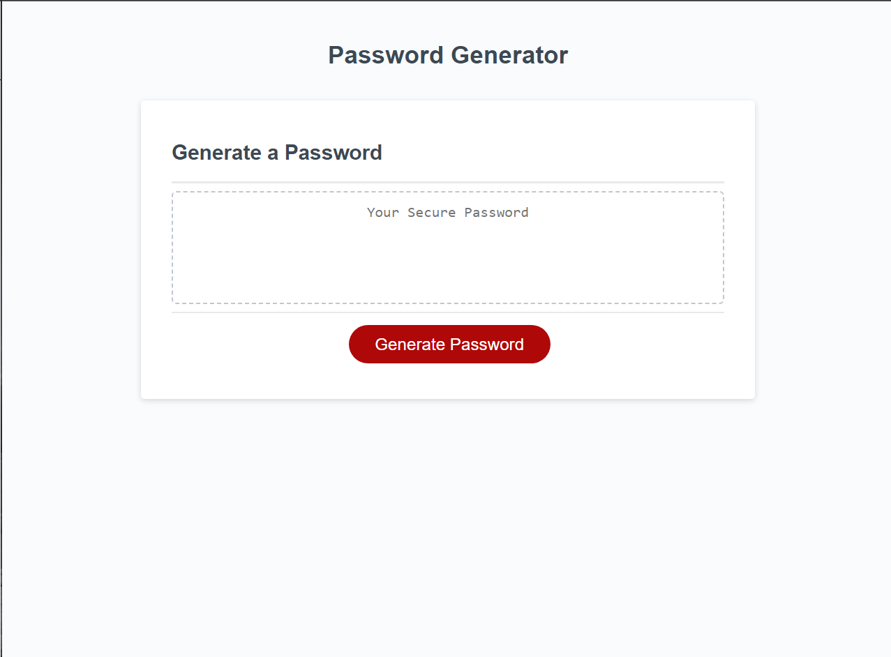

# Password Generator

## Description

This is a password generator that takes window prompts to select a randomized password based on uppercase letters, lowercase letters, numerics, and special characters to then return a unique random password.

## Usage

Please click the red "Generate Password" button and then follow the window prompts which will then create a new password within the dotted border section above the button.

Github Pages Link: 

https://tyler-cav.github.io/Password-Generator/

Screenshot of the active GitHub Page.
